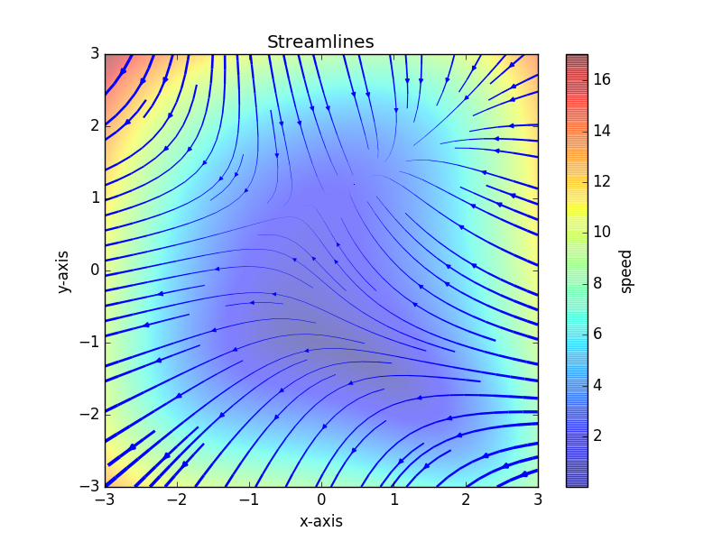

# Testing Reveal.js

A showcase of `reveal-md`

---

## Standard Markdown stuff

Some text here.

* Point 1
* Point 2

Here's some **bold** and *emphasized* text

1. Numbered point 1
2. Numbered point 2

> Blockquoting this!

---

## Syntax Highlighting

Here's some `code`, inline. 

```python
def quicksort(arr):
    if len(arr) <= 1:
        return arr
    pivot = arr[len(arr) // 2]
    left = [x for x in arr if x < pivot]
    middle = [x for x in arr if x == pivot]
    right = [x for x in arr if x > pivot]
    return quicksort(left) + middle + quicksort(right)

print(quicksort([3,6,8,10,1,2,1]))
# Prints "[1, 1, 2, 3, 6, 8, 10]"
```

Try out `Ctrl+Click` here

----

## More syntax highlighting

A little `R` (not quite right)

```r
library(dplyr)
iris %>%
    group_by(species)
    summarise(mean_len = mean(sepal_length))
```

And now some `bash` stuff

```shell
$ echo $HOME
/home/dorian
$ ls -l
total 12
-rw-rw-r--. 1 dorian dorian 5188 Jun 14 14:10 ing.css
-rw-rw-r--. 1 dorian dorian 1550 Jun 14 13:24 test.md
```

---

## Trying out tables

Here we print a markdown table.

| Tables        | Are           | Cool  |
| ------------- |:-------------:| -----:|
| col 3 is      | right-aligned | $1600 |
| col 2 is      | centered      |   $12 |
| zebra stripes | are neat      |    $1 |

---

## Some math

Here's some awesome $\LaTeX$!

$$y_t = F_t \Theta_t+ v_t$$

State equation.

$$\Theta_t = G_t \Theta_{t-1} + w_t$$

With noise error terms ($v$ and $w$)

---

## Subslides and fragments

We're going to

* break this <!-- .element: class="fragment" -->
* into pieces <!-- .element: class="fragment" -->

**Also, speaker notes!** <!-- .element: class="fragment" -->

Note: Don't forget to say the awesome things!

----

## First Subslide 

But first a subslide here.

----

## Second subslide

If you're lost in yours slides, hit `ESC` to zoom out

---

## Pictures allowed



----

## A Youtube video!?!?

<iframe width="560" height="315" src="https://www.youtube.com/embed/qI_g07C_Q5I" frameborder="0" allow="autoplay; encrypted-media" allowfullscreen></iframe>

----

And most other things that work in a web-page

---

## Hackable

This is a website (with CSS), so we can customize everything

```css
 .reveal .slides > section,
 .reveal .slides > section > section {
   background: white;
   line-height: 1.3;
   weight: 1; }
```

---

## Saving HTML locally

You can save it as a standalone HTML:

```bash
reveal-md test.md --static output.html
```

or as a pdf with

```shell
reveal-md test.md print output.pdf
```

