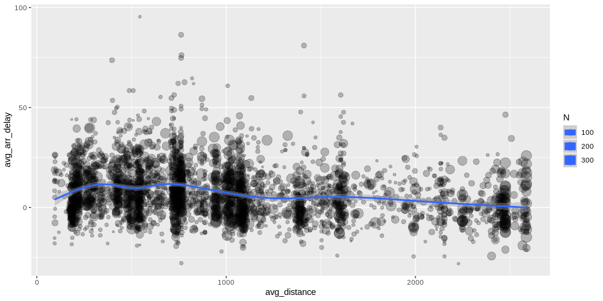

# Exploratory Data Analysis in R

A practical guide `dplyr`, `ggplot2`, and the tidyverse family

---

## Dorian Brown


- Grew up on the Cayman Islands
- Half Dutch half American
- Studied Pure Mathematics at Leiden University
- ~2 years Offshore industry, ~2 years ING

---

## Table of Contents

1. Short history of EDA
2. The pipe operator
3. Dplyr
4. Ggplot2
5. Some examples

---

## What this talk is

- Introduction to some great R packages
- A look at what we want from our EDA toolset
- Some cool tricks I wish I knew when I started
- An opinion

---

## What this talk isn't

- An introduction to R
- Me trying to convince you to throw away python
- Statistically rigorous

---

# Audience Participation

---

## Time before Computers


---

## Data before Computers


---

## Visualizations before Computers


---

## Visualizations before Computers


---

## The Age of Computers


---

## 1970s Bell Labs & Interactive Statistics


---

## 1970s Bell Labs & Interactive Statistics


---

## Aim and Process of EDA


Explore and gain understanding of the properties and relationships within a dataset

---

## What's the best tool for the job?

We need something that get's out of the way

- inuitive to write
- flexible
- easy to read/understand

---

# The Pipe (`%>%`) Operator

Making many chained functions readable

<!-- .slide: data-background="https://i.pinimg.com/originals/9b/11/2a/9b112aa30bc1ba530076bf0110dc5f3a.jpg" -->

---

## Sequential Functions

```python
on_hill = went_up(jack_jill, 'hill')
with_water = fetch(on_hill, 'water')
fallen = fell_down(with_water, 'jack')
broken = broke(fallen, 'jack')
after = tumble_after(broken, 'jill')
```

```python
tumble_after(
    broke(
        fell_down(
            fetch(went_up(jack_jill, "hill"), "water"),
            jack),
        "crown"),
    "jill"
)
```
<!-- .element: class="fragment fade-in" data-fragment-index="2" -->

---

## Pipe to the Rescue

Now with the `%>%` operator

```r
jack_jill %>%
    went_up("hill") %>%
    fetch("water") %>%
    fell_down("jack") %>%
    broke("crown") %>%
    tumble_after("jill")
```

Note: Simple, correct order, readable. Even without knowing %>%

---

## How the Pipe Can Be Used

Simple stuff

- `x %>% f` ➡️ `f(x)`
- `x %>% f(y)` ➡️ `f(x,y)`
- `x %>% f %>% g` ➡️  `g(f(x))`

Overriding **"first argument"** rule

- `x %>% f(y, .)` ➡️ `f(y, x)`
- `x %>% f(y, z = .)` ➡️ `f(y, z = x)`

---

# What about Python?

In pandas we can use method-chaining

```python
(jack_jill.pipe(went_up, 'hill')
    .pipe(fetch, 'water')
    .pipe(fell_down, 'jack')
    .pipe(broke, 'crown')
    .pipe(tumble_after, 'jill')
)
```

if the functions are pd.DataFrame methods we can write<!-- .element: class="fragment fade-in" data-fragment-index="1" -->

```python
(jack_jill.went_up('hill')
    .fetch('water')
    .fell_down('jack')
    .broke('crown')
    .tumble_after('jill')
)
```
<!-- .element: class="fragment fade-in" data-fragment-index="1" -->

Note: Custom functions problematic. More "line noise"

---

# Dplyr

A grammer of data manipulation

<!-- .slide: data-background="https://makelmail.nl/wp-content/uploads/2017/05/big-data.jpg" -->

---

## Whats a Grammer?

<blockquote>
A **Grammer** is the set of structured rules governing the composition of clauses, phrases, and words in any given (natural) langauge
</blockquote>
<cite> — Wikipedia </cite>

---

## The "Verbs"

The idea behind dplyr is to have a few simple functions which can be combined to create more advanced behavior in some consistent way:

- `mutate`: Create or overwrite columns
- `select`: Subsets columns by name
- `filter`: Subsets rows by values
- `summarise`: Reduces multiple row values to single values
- `arrange`: Orders rows
- `group_by`: Groups rows by condition

Note: Mention how this is similar to SQL. While old fashioned, SQL has been the standard language for dealing with data since 1974 (44 years).

---
# Loading the data

``` r
> library(dplyr)
> 
> flights <- nycflights13::flights 
> flights %>% str()

Classes ‘tbl_df’, ‘tbl’ and 'data.frame':	336776 obs. of  19 variables:
 $ year          : int  2013 2013 2013 2013 2013 2013 2013 2013 2013 2013 ...
 $ month         : int  1 1 1 1 1 1 1 1 1 1 ...
 $ day           : int  1 1 1 1 1 1 1 1 1 1 ...
 $ dep_time      : int  517 533 542 544 554 554 555 557 557 558 ...
 $ sched_dep_time: int  515 529 540 545 600 558 600 600 600 600 ...
 $ dep_delay     : num  2 4 2 -1 -6 -4 -5 -3 -3 -2 ...
 $ arr_time      : int  830 850 923 1004 812 740 913 709 838 753 ...
 $ sched_arr_time: int  819 830 850 1022 837 728 854 723 846 745 ...
 $ arr_delay     : num  11 20 33 -18 -25 12 19 -14 -8 8 ...
 $ carrier       : chr  "UA" "UA" "AA" "B6" ...
 $ flight        : int  1545 1714 1141 725 461 1696 507 5708 79 301 ...
 $ tailnum       : chr  "N14228" "N24211" "N619AA" "N804JB" ...
 $ origin        : chr  "EWR" "LGA" "JFK" "JFK" ...
 $ dest          : chr  "IAH" "IAH" "MIA" "BQN" ...
 $ air_time      : num  227 227 160 183 116 150 158 53 140 138 ...
 $ distance      : num  1400 1416 1089 1576 762 ...
 $ hour          : num  5 5 5 5 6 5 6 6 6 6 ...
 $ minute        : num  15 29 40 45 0 58 0 0 0 0 ...
 $ time_hour     : POSIXct, format: "2013-01-01 05:00:00" "2013-01-01 05:00:00" ...

```

---

# Manipulating columns

---

## Selecting columns

``` r
> flights %>%
      select(year, month, day, dep_time, arr_time)
```

```r
# A tibble: 336,776 x 5
    year month   day dep_time arr_time
   <int> <int> <int>    <int>    <int>
 1  2013     1     1      517      830
 2  2013     1     1      533      850
 3  2013     1     1      542      923
 4  2013     1     1      544     1004
 5  2013     1     1      554      812
# ... with 336,766 more rows
```
<!-- .element: class="fragment fade-in" data-fragment-index="1" -->

---

## Removing columns

``` r
> flights %>%
      select(-year, -month, -day)
```

```r
# A tibble: 336,776 x 16
   dep_time sched_dep_time dep_delay arr_time sched_arr_time arr_delay
      <int>          <int>     <dbl>    <int>          <int>     <dbl>
 1      517            515         2      830            819        11
 2      533            529         4      850            830        20
 3      542            540         2      923            850        33
 4      544            545        -1     1004           1022       -18
 5      554            600        -6      812            837       -25
# ... with 336,766 more rows, and 10 more variables: carrier <chr>,
#   flight <int>, tailnum <chr>, origin <chr>, dest <chr>, air_time <dbl>,
#   distance <dbl>, hour <dbl>, minute <dbl>, time_hour <dttm>

```
<!-- .element: class="fragment fade-in" data-fragment-index="1" -->

---

## Selecting and renaming

``` r
> flights %>%
      select("departure" = dep_time)
```
```r
# A tibble: 336,776 x 1
   departure
       <int>
 1       517
 2       533
 3       542
 4       544
 5       554
# ... with 336,766 more rows

```
<!-- .element: class="fragment fade-in" data-fragment-index="1" -->

---

## Selecting with helper functions

``` r
> flights %>%
      select(ends_with("time"))
```

```r
# A tibble: 336,776 x 5
   dep_time sched_dep_time arr_time sched_arr_time air_time
      <int>          <int>    <int>          <int>    <dbl>
 1      517            515      830            819      227
 2      533            529      850            830      227
 3      542            540      923            850      160
 4      544            545     1004           1022      183
 5      554            600      812            837      116
# ... with 336,766 more rows

```
<!-- .element: class="fragment fade-in" data-fragment-index="1" -->

---

## Selecting with helper functions

- `starts_with()`: starts with a prefix
- `ends_with()`: ends with a prefix
- `contains()`: contains a literal string
- `matches()`: matches a regular expression
- `num_range()`: a numerical range like x0, x1, x2.
- `one_of()`: variables in character vector.
- `everything()`: all variables.
---

## Selecting using column range

``` r
> flights %>%
      select(year:arr_delay)
```

```r
# A tibble: 336,776 x 9
    year month   day dep_time sched_dep_time dep_delay arr_time
   <int> <int> <int>    <int>          <int>     <dbl>    <int>
 1  2013     1     1      517            515         2      830
 2  2013     1     1      533            529         4      850
 3  2013     1     1      542            540         2      923
 4  2013     1     1      544            545        -1     1004
 5  2013     1     1      554            600        -6      812
# ... with 336,766 more rows, and 2 more variables: sched_arr_time <int>,
#   arr_delay <dbl>

```
<!-- .element: class="fragment fade-in" data-fragment-index="1" -->

---

## Creating columns with mutate()

``` r
> flights_mut <- flights %>%
      select(year, month, day, dep_time, sched_dep_time, arr_time, sched_arr_time)
>
> flights_mut %>%
      mutate(dep_delay = dep_time - sched_dep_time,
             arr_delay = arr_time - sched_arr_time)
```

```r
# A tibble: 336,776 x 9
    year month   day dep_time sched_dep_time arr_time sched_arr_time
   <int> <int> <int>    <int>          <int>    <int>          <int>
 1  2013     1     1      517            515      830            819
 2  2013     1     1      533            529      850            830
 3  2013     1     1      542            540      923            850
 4  2013     1     1      544            545     1004           1022
 5  2013     1     1      554            600      812            837
# ... with 336,766 more rows, and 2 more variables: dep_delay <int>,
#   arr_delay <int>

```
<!-- .element: class="fragment fade-in" data-fragment-index="1" -->

---

## Using mutate to select columns

``` r
> date_to_epoch <- function(y, m, d) (y + m/12)*365.25*24*3600 + d*3600
> 
> flights_mut %>%
      transmute(year, day, month,
                epoch = date_to_epoch(year, month, day))
```

```r

# A tibble: 336,776 x 4
    year   day month       epoch
   <int> <int> <int>       <dbl>
 1  2013     1     1 63528082200
 2  2013     1     1 63528082200
 3  2013     1     1 63528082200
 4  2013     1     1 63528082200
 5  2013     1     1 63528082200
# ... with 336,766 more rows

```
<!-- .element: class="fragment fade-in" data-fragment-index="1" -->

---

# Manipulating rows

---

## Filtering rows

``` r
> flights %>%
      filter(carrier == "UA")
 
```

```r
# A tibble: 58,665 x 19
    year month   day dep_time sched_dep_time dep_delay arr_time
   <int> <int> <int>    <int>          <int>     <dbl>    <int>
 1  2013     1     1      517            515         2      830
 2  2013     1     1      533            529         4      850
 3  2013     1     1      554            558        -4      740
 4  2013     1     1      558            600        -2      924
 5  2013     1     1      558            600        -2      923
# ... with 58,655 more rows, and 12 more variables: sched_arr_time <int>,
#   arr_delay <dbl>, carrier <chr>, flight <int>, tailnum <chr>,
#   origin <chr>, dest <chr>, air_time <dbl>, distance <dbl>, hour <dbl>,
#   minute <dbl>, time_hour <dttm>

```
<!-- .element: class="fragment fade-in" data-fragment-index="1" -->

---

## Fancy filtering

``` r
> flights %>%
      filter(sched_dep_time - dep_time < sched_arr_time - arr_time, carrier == "UA")

```

```r
# A tibble: 39,433 x 19
    year month   day dep_time sched_dep_time dep_delay arr_time
   <int> <int> <int>    <int>          <int>     <dbl>    <int>
 1  2013     1     1      559            600        -1      854
 2  2013     1     1      607            607         0      858
 3  2013     1     1      643            646        -3      922
 4  2013     1     1      644            636         8      931
 5  2013     1     1      646            645         1      910
# ... with 39,423 more rows, and 12 more variables: sched_arr_time <int>,
#   arr_delay <dbl>, carrier <chr>, flight <int>, tailnum <chr>,
#   origin <chr>, dest <chr>, air_time <dbl>, distance <dbl>, hour <dbl>,
#   minute <dbl>, time_hour <dttm>
```
<!-- .element: class="fragment fade-in" data-fragment-index="1" -->

---

## Helper functions are great for filtering too

``` r
> flights %>%
      filter(is.na(arr_delay)) %>%
      nrow()

```

```r
[1] 9430
```
<!-- .element: class="fragment fade-in" data-fragment-index="1" -->

---

## Even base R can be elegant

``` r
> flights %>%
      filter(dest %in% c("MIA", "JFK"))

```

```r
# A tibble: 11,728 x 19
    year month   day dep_time sched_dep_time dep_delay arr_time
   <int> <int> <int>    <int>          <int>     <dbl>    <int>
 1  2013     1     1      542            540         2      923
 2  2013     1     1      606            610        -4      858
 3  2013     1     1      607            607         0      858
 4  2013     1     1      623            610        13      920
 5  2013     1     1      655            700        -5     1002
# ... with 11,718 more rows, and 12 more variables: sched_arr_time <int>,
#   arr_delay <dbl>, carrier <chr>, flight <int>, tailnum <chr>,
#   origin <chr>, dest <chr>, air_time <dbl>, distance <dbl>, hour <dbl>,
#   minute <dbl>, time_hour <dttm>
```
<!-- .element: class="fragment fade-in" data-fragment-index="1" -->
---

## Order rows with arrange()

``` r
> flights %>%
      arrange(sched_dep_time)

```

```r
# A tibble: 336,776 x 19
    year month   day dep_time sched_dep_time dep_delay arr_time
   <int> <int> <int>    <int>          <int>     <dbl>    <int>
 1  2013     7    27       NA            106        NA       NA
 2  2013     1     2      458            500        -2      703
 3  2013     1     3      458            500        -2      650
 4  2013     1     4      456            500        -4      631
 5  2013     1     5      458            500        -2      640
# ... with 336,766 more rows, and 12 more variables: sched_arr_time <int>,
#   arr_delay <dbl>, carrier <chr>, flight <int>, tailnum <chr>,
#   origin <chr>, dest <chr>, air_time <dbl>, distance <dbl>, hour <dbl>,
#   minute <dbl>, time_hour <dttm>

```
<!-- .element: class="fragment fade-in" data-fragment-index="1" -->

---

## Ordering by mulitple columns

``` r
> flights %>%
      arrange(year, month, -day)

```

```r
# A tibble: 336,776 x 19
    year month   day dep_time sched_dep_time dep_delay arr_time
   <int> <int> <int>    <int>          <int>     <dbl>    <int>
 1  2013     1    31        1           2100       181      124
 2  2013     1    31        4           2359         5      455
 3  2013     1    31        7           2359         8      453
 4  2013     1    31       12           2250        82      132
 5  2013     1    31       26           2154       152      328
# ... with 336,766 more rows, and 12 more variables: sched_arr_time <int>,
#   arr_delay <dbl>, carrier <chr>, flight <int>, tailnum <chr>,
#   origin <chr>, dest <chr>, air_time <dbl>, distance <dbl>, hour <dbl>,
#   minute <dbl>, time_hour <dttm>
```
<!-- .element: class="fragment fade-in" data-fragment-index="1" -->

---

## Order by function

``` r
> flights %>%
      arrange(abs(dep_delay)) %>%
      tail()

```

```r
# A tibble: 6 x 19
   year month   day dep_time sched_dep_time dep_delay arr_time
  <int> <int> <int>    <int>          <int>     <dbl>    <int>
1  2013     9    30       NA           1842        NA       NA
2  2013     9    30       NA           1455        NA       NA
3  2013     9    30       NA           2200        NA       NA
4  2013     9    30       NA           1210        NA       NA
5  2013     9    30       NA           1159        NA       NA
6  2013     9    30       NA            840        NA       NA
# ... with 12 more variables: sched_arr_time <int>, arr_delay <dbl>,
#   carrier <chr>, flight <int>, tailnum <chr>, origin <chr>, dest <chr>,
#   air_time <dbl>, distance <dbl>, hour <dbl>, minute <dbl>,
#   time_hour <dttm>
```
<!-- .element: class="fragment fade-in" data-fragment-index="1" -->

---

## Grouping and Aggregation

---

## Grouping with group_by()

``` r
> flights %>%
      group_by(carrier)

```

```r
# A tibble: 336,776 x 19
# Groups:   carrier [16]
    year month   day dep_time sched_dep_time dep_delay arr_time
   <int> <int> <int>    <int>          <int>     <dbl>    <int>
 1  2013     1     1      517            515         2      830
 2  2013     1     1      533            529         4      850
 3  2013     1     1      542            540         2      923
 4  2013     1     1      544            545        -1     1004
 5  2013     1     1      554            600        -6      812
# ... with 336,766 more rows, and 12 more variables: sched_arr_time <int>,
#   arr_delay <dbl>, carrier <chr>, flight <int>, tailnum <chr>,
#   origin <chr>, dest <chr>, air_time <dbl>, distance <dbl>, hour <dbl>,
#   minute <dbl>, time_hour <dttm>
```
<!-- .element: class="fragment fade-in" data-fragment-index="1" -->

---

## Aggregating with summarise()

``` r
> flights %>% 
    group_by(dest) %>% 
    summarise(N = n()) %>% 
    arrange(-N)

```

```r
# A tibble: 105 x 2
   dest      N
   <chr> <int>
 1 ORD   17283
 2 ATL   17215
 3 LAX   16174
 4 BOS   15508
 5 MCO   14082
# ... with 95 more rows

```
<!-- .element: class="fragment fade-in" data-fragment-index="1" -->

---

## Group_by and mutate works too!

``` r
> flights %>%
      group_by(carrier, dest) %>%
      mutate(delta_mean_airtime = air_time - mean(air_time, na.rm = T)) %>%
      select(flight, carrier, dest, delta_mean_airtime)
```

```r
# A tibble: 336,776 x 4
# Groups:   carrier, dest [314]
   flight carrier dest  delta_mean_airtime
    <int> <chr>   <chr>              <dbl>
 1   1545 UA      IAH                29.1 
 2   1714 UA      IAH                29.1 
 3   1141 AA      MIA                 7.12
 4    725 B6      BQN               -11.2 
 5    461 DL      ATL                 3.84
# ... with 336,766 more rows
```
<!-- .element: class="fragment fade-in" data-fragment-index="1" -->

---

## And also joins

``` r
> airlines <- nycflights13::airlines
> 
> flights %>%
      inner_join(airlines, by = c("carrier")) %>%
      select(flight, carrier, name)
```

```r
# A tibble: 336,776 x 3
   flight carrier name                    
    <int> <chr>   <chr>                   
 1   1545 UA      United Air Lines Inc.   
 2   1714 UA      United Air Lines Inc.   
 3   1141 AA      American Airlines Inc.  
 4    725 B6      JetBlue Airways         
 5    461 DL      Delta Air Lines Inc.    
# ... with 336,766 more rows
```
<!-- .element: class="fragment fade-in" data-fragment-index="1" -->

---

## And lots more

Check out the [dplyr vignette](https://cran.r-project.org/web/packages/dplyr/vignettes/dplyr.html) for more details

---

# Ggplot2

A grammer of graphics

<!-- .slide: data-background="images/ridgeline.png" -->

---

##  Grammer of Graphics

<blockquote>
In brief, the grammar tells us that a statistical graphic is a mapping from data to **aesthetic attributes** (colour, shape, size) of **geometric objects** (points, lines, bars). The plot may also contain **statistical transformations** of the data and is drawn on a specific **coordinates system**.
</blockquote>
<cite> —  Hadley Wickham</cite>

---

## Basics of Ggplot


---

## Basics of Ggplot


---

## Basics of Ggplot


---

## Basics of Ggplot


---

## Basics of Ggplot


---

## Basics of Ggplot


---

## Basics of Ggplot


---

## Basics of Ggplot


---

## What about Python?


- Many packages influenced by ggplot2
- If you want ggplot2 in python, try `plotnine`
- Direct copy is hard due to R's language features

---

# Lets Explore!

---

```r
flights <- nycflights13::flights

flights %>%
    sample_n(10000) %>%
    ggplot(aes(distance, arr_delay)) + geom_point()
```


<!-- .element: class="fragment fade-in" data-fragment-index="1" -->

---

```r
flights %>%
    sample_n(10000) %>%
    filter(distance < 3000) %>%
    ggplot(aes(distance, arr_delay)) + geom_point()
```


<!-- .element: class="fragment fade-in" data-fragment-index="1" -->

---

```r
flights %>%
    sample_n(10000) %>%
    filter(distance < 3000) %>%
    ggplot(aes(distance, arr_delay)) + geom_point(alpha = 0.1) + geom_smooth()
```


<!-- .element: class="fragment fade-in" data-fragment-index="1" -->

---

```r
flights %>% 
    mutate(flight_num = paste0(carrier, flight)) %>%
    group_by(flight_num, carrier) %>%
    summarise(N = n(),
              avg_arr_delay = mean(arr_delay),
              avg_distance = mean(distance))
```

```r
# A tibble: 5,725 x 5
# Groups:   flight_num [?]
   flight_num carrier     N avg_arr_delay avg_distance
   <chr>      <chr>   <int>         <dbl>        <dbl>
 1 9E2900     9E         59         0.983         765 
 2 9E2901     9E         55        15.8           187 
 3 9E2902     9E         55        NA             187 
 4 9E2903     9E         56        NA             358.
 5 9E2904     9E         57        NA             204.
 6 9E2905     9E          8        -8.38          187 
 7 9E2906     9E         41        NA             301 
 8 9E2907     9E         45        NA             301 
 9 9E2908     9E         58        NA             301 
10 9E2909     9E         29        NA             337.
# ... with 5,715 more rows
```
<!-- .element: class="fragment fade-in" data-fragment-index="1" -->

---

```r
flights %>% 
    mutate(flight_num = paste0(carrier, flight)) %>%
    group_by(flight_num, carrier) %>%
    summarise(N = n(),
              avg_arr_delay = mean(arr_delay, na.rm = T),
              avg_distance = mean(distance, na.rm = T))
```

```r
# A tibble: 5,725 x 5
# Groups:   flight_num [?]
   flight_num carrier     N avg_arr_delay avg_distance
   <chr>      <chr>   <int>         <dbl>        <dbl>
 1 9E2900     9E         59         0.983         765 
 2 9E2901     9E         55        15.8           187 
 3 9E2902     9E         55         1.87          187 
 4 9E2903     9E         56         7.34          358.
 5 9E2904     9E         57        12.2           204.
 6 9E2905     9E          8        -8.38          187 
 7 9E2906     9E         41        14.5           301 
 8 9E2907     9E         45         5.30          301 
 9 9E2908     9E         58        17.7           301 
10 9E2909     9E         29        -1             337.
# ... with 5,715 more rows
```
<!-- .element: class="fragment fade-in" data-fragment-index="1" -->

---

```r
flights %>% 
    mutate(flight_num = paste0(carrier, flight)) %>%
    group_by(flight_num, carrier) %>%
    summarise(N = n(),
              avg_arr_delay = mean(arr_delay, na.rm = T),
              avg_distance = mean(distance, na.rm = T)) %>%
    ggplot(aes(x = avg_distance, y = avg_arr_delay, size = N)) + 
        geom_point() + 
        geom_smooth()
```


<!-- .element: class="fragment fade-in" data-fragment-index="1" -->

---

```r
flights %>% 
    mutate(flight_num = paste0(carrier, flight)) %>%
    group_by(flight_num, carrier) %>%
    summarise(N = n(),
              avg_arr_delay = mean(arr_delay, na.rm = T),
              avg_distance = mean(distance, na.rm = T)) %>%
    filter(N > 20, avg_distance < 3000) %>%
    ggplot(aes(x = avg_distance, y = avg_arr_delay, size = N)) + 
        geom_point(alpha = 0.25) + 
        geom_smooth()
```


<!-- .element: class="fragment fade-in" data-fragment-index="1" -->

---

```r
library(lubridate)

flights %>%
    sample_n(10000) %>%
    mutate(week = as.factor(week(time_hour))) %>%
    select(week, arr_delay, dep_delay) %>%
    tidyr::gather("delay_type", "delay", 2:3)
```

```r
# A tibble: 20,000 x 3
   week  delay_type delay
   <fct> <chr>      <dbl>
 1 43    arr_delay     11
 2 19    arr_delay    -16
 3 30    arr_delay     89
 4 36    arr_delay    -21
 5 27    arr_delay    -18
 6 10    arr_delay     56
 7 38    arr_delay    -28
 8 44    arr_delay    -30
 9 44    arr_delay    -19
10 22    arr_delay     33
# ... with 19,990 more rows
```
<!-- .element: class="fragment fade-in" data-fragment-index="1" -->

---

```r
flights %>%
    sample_n(10000) %>%
    mutate(week = as.factor(week(time_hour))) %>%
    select(week, arr_delay, dep_delay) %>%
    tidyr::gather("delay_type", "delay", 2:3) %>%
    ggplot(aes(x = week, y = delay, fill = delay_type)) + 
        geom_boxplot(outlier.shape = NA) + 
        scale_y_continuous(limits = c(-75,125))
```

---


---

```r
flights %>%
    sample_n(10000) %>%
    mutate(week = as.factor(week(time_hour))) %>%
    select(week, origin, arr_delay, dep_delay) %>%
    tidyr::gather("delay_type", "delay", 3:4) %>%
    ggplot(aes(x = week, y = delay, fill = delay_type)) + 
        geom_boxplot(outlier.shape = NA) + 
        scale_y_continuous(limits = c(-75,125)) +
        facet_grid(origin~.)
```

---


---

```r
flights %>%
    sample_n(10000) %>%
    mutate(week = as.factor(week(time_hour))) %>%
    select(week, origin, arr_delay, dep_delay) %>%
    tidyr::gather("delay_type", "delay", 3:4) %>%
    ggplot(aes(x = week, y = delay, fill = origin)) + 
    geom_boxplot(outlier.shape = NA) + 
    scale_y_continuous(limits = c(-75,125)) +
    facet_grid(delay_type~.)
```

---


---

# Let's use some Maps

```r
> airports <- nycflights13::airports %>% 
      filter(stringr::str_detect(tzone, "America"), 
             !stringr::str_detect(tzone, "Anchorage")) %>%
      select(faa:alt)

# A tibble: 1,196 x 5
   faa   name                             lat    lon   alt
   <chr> <chr>                          <dbl>  <dbl> <int>
 1 04G   Lansdowne Airport               41.1  -80.6  1044
 2 06A   Moton Field Municipal Airport   32.5  -85.7   264
 3 06C   Schaumburg Regional             42.0  -88.1   801
 4 06N   Randall Airport                 41.4  -74.4   523
 5 09J   Jekyll Island Airport           31.1  -81.4    11
# ... with 1,186 more rows
```

```r
flights <- flights %>%
    left_join(airports, by = c("origin" = "faa")) %>%
    left_join(airports, by = c("dest" = "faa"), suffix = c("_orig", "_dest"))
```

```r
states <- map_data("state")
```

---

```r
states <- map_data("state")
ggplot() +
    geom_polygon(data = states, 
                 aes(x = long, y = lat, fill = region, group = group), 
                 color = "grey", 
                 fill = "white")
```


---

## Store this for later

```r
dscc_map <- geom_polygon(data = states, 
                         aes(x = long, y = lat, fill = region, group = group), 
                         color = "grey", 
                         fill = "white")
```
---

```r
airports %>%
    sample_n(1000) %>%
    ggplot(aes(x = lon, y = lat, color = alt)) + dscc_map + geom_point()
```


<!-- .element: class="fragment fade-in" data-fragment-index="1" -->

---

```r
flights %>%
    group_by(dest) %>%
    summarise(num_flights = n()) %>%
    ungroup() %>%
    left_join(airports, by = c("dest" = "faa")) %>%
    ggplot() +
        dscc_map +
        geom_point(aes(x = lon, y = lat, size = num_flights)) + 
        geom_label_repel(data = . %>% filter(num_flights > 10000), 
                        aes(x = lon, y = lat, label = name, color = "red"),
                        nudge_x = -2,
                        nudge_y = -2)
```

---


---

```r
flights %>%
    group_by(origin, dest) %>%
    summarise(N = n()) %>%
    left_join(airports, by = c("origin" = "faa")) %>%
    left_join(airports, by = c("dest" = "faa")) %>%
    ggplot() + 
        dscc_map +
        geom_segment(aes(x = lon.x, y = lat.x,
                         xend = lon.y, yend = lat.y, 
                         color = origin), 
                     alpha = 0.5, size = 1)
```
---


---

```r
flights %>%
    group_by(origin, dest) %>%
    summarise(N = n()) %>%
    left_join(airports, by = c("origin" = "faa")) %>%
    left_join(airports, by = c("dest" = "faa")) %>%
    ggplot() + 
        dscc_map +
        geom_jitter(aes(x = lon.y, y = lat.y, color = origin), size = 2.5, height=0.25, width=0.25)
```

---


---

## A few last closing remarks

---

## Dplyr backends

Instead of using a dataframe, you can make dplyr work on other data sources:

```r
sc <- spark_connect(master = "local")
mytable <- tbl(sc, "mytable")

mytable %>%
    group_by() %>%
    summarise() %>%
    etc() %>%
    collect()
```

Also supports Hive and most SQL databases

---

## Random Tips

- Checkout the [Rstudio cheatsheets](https://www.rstudio.com/resources/cheatsheets/)
- Use [rdocumentation.org](http://rdocumentation.org/) for documentation

---

## Thanks for Listening!
