# Logistic Regression

----

## Table of Contents

1. Derivation of logistic regression
2. Error function and maximum likelihood
3. Finding best model parameters
    - (Stochastic) Gradient Descent
    - Newton's Method
    - BFGS
4. Reducing Overfitting
5. Building your own Logistic Regression

----

## About Logistic Regression

- Popularized by David Cox in 1950s
- Although a regression technique, often used for classification
- Also called **logit**
- Still very popular due to being **easy to understand and explain**, while still giving **good results**

---

# Derivation

The logistic regression is part of the **generalized linear model (GLM)** family:

$$ \begin{align} P(Y|X=x) &= \sigma(\beta_0 + \beta_1x_1 + \dots) 
    \\\\ & = \sigma(\beta_0 + \beta^\intercal X) \end{align} $$

in the case of logistic regression, we have $\sigma(x) = 1/(1 + e^{-x})$ to give:

$$ P(Y|X=x) = \frac{1}{1 + e^{-\beta^\intercal X}} $$

----

In the case of 1-dimensional $X$, we get

$$ P(Y|X=x) = \frac{1}{1+e^{-(\beta_0 + \beta_1 x)}}$$

which, when trained, looks like this

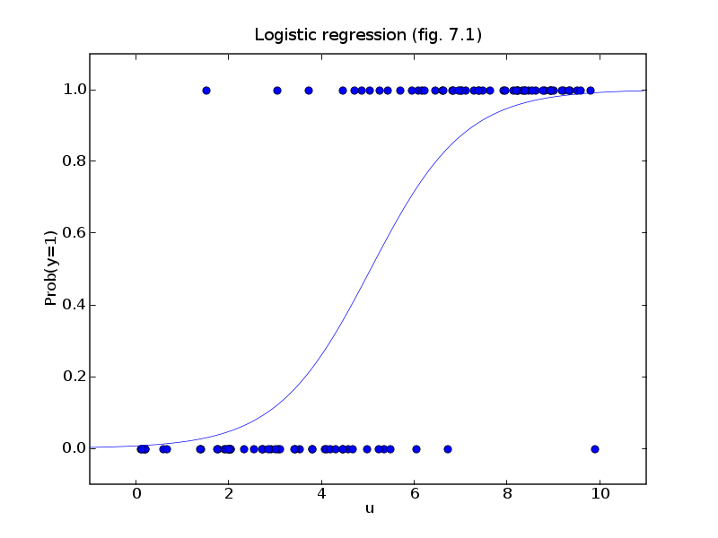

----

So what happens when we change the parameters $\beta_0, \beta_1$?

----

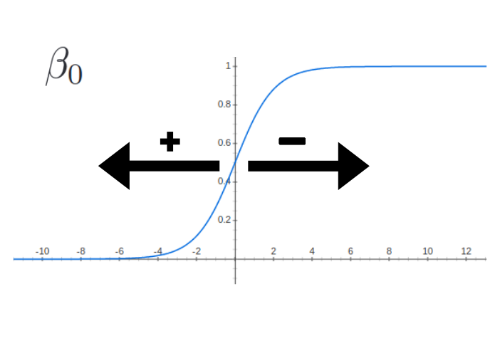

----

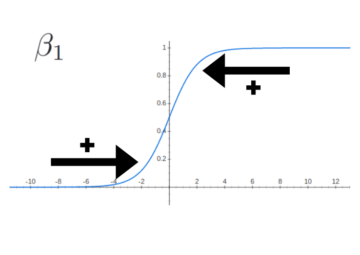

----

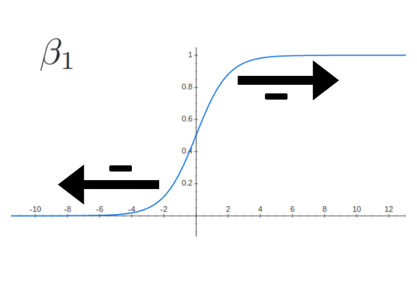

----

## Interpretation of weighted sum

$$ \begin{align} P(Y=1|X = x) &= \frac{1}{1 + e^{-\beta^\intercal x}}
    \\\\ P(Y=1|X = x)\left( 1 + e^{-\beta^\intercal x}\right) & = 1
    \\\\ P(Y=1|X = x) + P(Y=1|X = x)e^{-\beta^\intercal x} & = 1
    \\\\ P(Y=1|X = x)\left( 1 + e^{-\beta^\intercal x}\right) & = 1 \end{align} $$

We can write $1 - P(Y=1|X = x) = P(Y=0|X = x)$ to obtain:

$$ \begin{align}  \frac{P(Y=1|X = x)}{P(Y=0|X = x)} & = e^{\beta^\intercal x}
    \\\\ \log\left(\frac{P(Y=1|X = x)}{P(Y=0|X = x)}\right) & = \beta^\intercal x \end{align} $$

----

This last expression 

> $$ \log\left(\frac{P(Y=1|X = x)}{P(Y=0|X = x)}\right) = \beta^\intercal x $$

tells us that the weighted sum of the data can be interpreted as the **log-odds ratio**

----

# Another interpretation

> We can also view this as a sequence of mappings

- A function which maps the vector $x$ to a single real number

$$\mathbb{R}^m \rightarrow \mathbb{R}: x \mapsto \beta^\intercal x$$

- A function which normalizes this number to a probability (monotonically):

$$\mathbb{R} \rightarrow [0,1]: x \mapsto \frac{1}{1 + e^{-x}} $$

----

## Decision Boundary

One problem left, we want values in $\\{0,1\\}$, not $[0,1]$.

We can solve this by introducing a **threshold $t$**

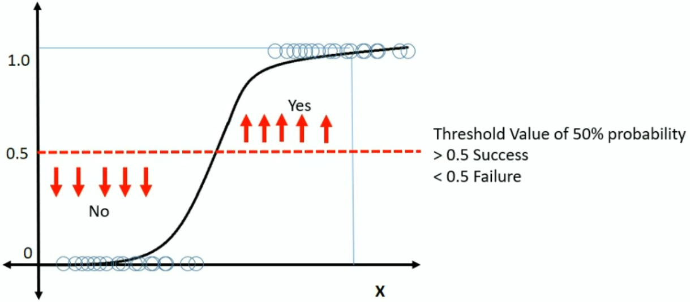

----

## Finding decision boundary

Let's find the boundary in our parameter space $x \in \mathbb{R}^m$:

$$ \begin{align} P(Y = 1 | X = x) & = \frac{1}{1 + e^{-\beta^\intercal x}}
    \\\\ & = 1/2 \end{align} $$

We can rewrite this as

$$ \begin{align}\frac{1}{1 + e^{-\beta^\intercal x}} & = \frac{1}{2}
    \\\\ 1 + e^{-\beta^\intercal x} & = 2 
    \\\\ e^{-\beta^\intercal x} & = 1
    \\\\ \beta^\intercal x & = 0\end{align} $$

----

## Finding decision boundary

The boundary is the set of points $\\{x \in \mathbb{R}^m: \beta^\intercal x = 0\\}$

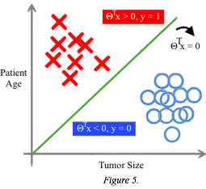

Notes: Decision boundary is linear because beta*x=0

---

# Evaluating Models

So now that we've defined a model $\hat{y}_\beta$, we now have to find out how to choose the best one to fit our data.

In order to make this decision, we first need to **define what a good model is.**

> We do this with an **Loss function.**

----

## Evaluating Models

We want a function that maps $\mathcal{L}: \mathbb{R}^{m+1} \rightarrow \mathbb{R}: \beta \mapsto \mathcal{L}(\hat{y}_\beta(x), y)$

This will allow us to, given the features $x$ and labels $y$, compare two sets of parameters to see which one performs better.

Often the **log-likelihood (aka cross-entropy)** is used for this 

----

## Log-likelihood

The likelihood $\mathcal{L}$ is expressed by

$$ \mathcal{L}(\beta) = \prod\_{i=1}^nP(Y = y_i|X=x_i; \beta)$$

which is the probability of the data occuring, given the model parameter $\beta$. 

This is hard to work with, so we usually work with the log-likelihood

$$ \log \mathcal{L}(\beta) = \sum\_{i=1}^n\log P(Y = y_i|X=x_i; \beta)$$

> Note that $\mathcal{L}$ and $\log \mathcal{L}$ have the same maximum

Notes: We assume independence of variables here!

----

## Log-likekelihood

We can rewrite this to another common form using the powers of math:

$$ \begin{align} \log \mathcal{L}(\beta) & = \sum\_{i=1}^n\log P(Y = y_i|X=x\_i; \beta)
    \\\\ & = \sum\_{i=1}^n\log P(Y = 1|X=x_i; \beta)^{y_i} + \log P(Y = 0|X=x_i; \beta)^{(1 - y\_i)} 
    \\\\ & = \sum\_{i=1}^n y\_i\log (\hat{y}_\beta(x)) + (1 - y\_i)\log (1 - \hat{y}_\beta(x_i))  \end{align} $$

The form at the bottom is called the **cross-entropy**

----

## Why maximum likelihood?

- Unbiased and consistent (under certain conditions)

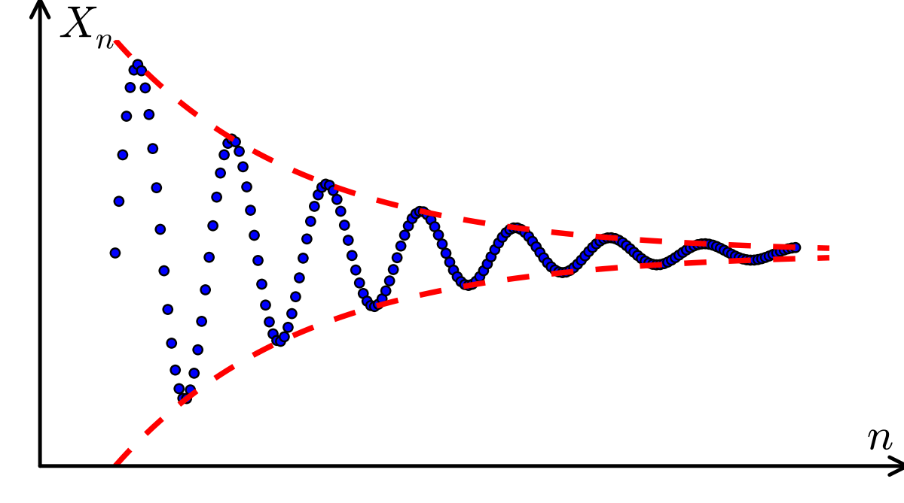

- Concave function on parameter space

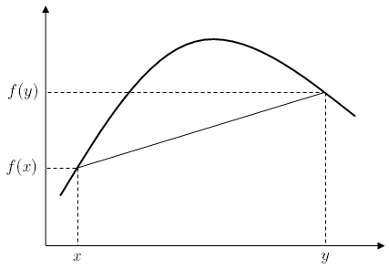

Notes: Super nice for optimization

---

# Finding the Best Model Parameters

----

## Gradient Descent Algorithm

> Start at a random point, and follow the slope downwards until we stop

Notes: Simple intuition, which can help us understand the method

----

## Gradient Descent Algorithm

> 1. Set $a_0$ to some starting parameters (e.g. 0)
> 2. Until some condition (iterations, closeness), do:
>   - Calculate $a_{n+1}=a_n - \gamma \nabla F(a_n)$

Note that we need to choose the **starting point $a_0$**, the **learning rate $\gamma$**, and the **stopping criterion**.

----

## Calculating Gradient $\nabla F(a_n)$

> $\nabla f := \left(\frac{\partial f}{\partial x_1},\dots ,\frac{\partial f}{\partial x_m}\right)$

With some math and the chain rule we can show that 

$$\frac{\partial \log\mathcal{L}}{\partial \beta\_j} = \sum\_{i=1}^n \left(\hat{y}_\beta(x^i) - y^i\right)x^i_j$$

We can vectorize this to:

$$ \nabla \log \mathcal{L} = x^\intercal \left(\hat{y}_\beta(x) - y\right)$$

----

## Choosing $\gamma$

Watch out what learning rate is chosen:

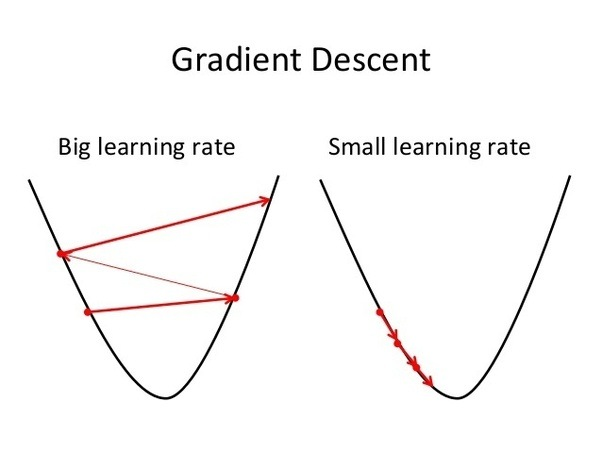

There are dynamic learning rates $\gamma_n$ which calculate the optimal rate

----

# Normalizing features

Normalizing features can make convergence faster

----

## Gradient Descent Algorithm

Some limitations:

1. Slow converge (there are faster methods)
2. Only finds global maximum on convex functions
3. Our objective function must be differentiable to find gradient

----

## Stochastic Gradient Descent

Often Stochastic Gradient Descent is used instead of plan GD

> Instead of calculating the gradient $\nabla \log \mathcal{L}$ on all rows of data: 
> - randomly pick a row $x_i$
> - update $\beta$ with the gradient for the loss at $x_i$
> - if stopping criterion is fulfilled, stop

**Mini-batch gradient descent** uses a batch $\\{x_i,\dots,x_j\\}$ for updating $\beta$

---

## Newton's Method

> 1. Initialize at starting point $a_0$
> 2. Calculate 2nd order taylor approximation $T$ of $F$ at $a_0$
> 3. Find minimum of $T$, and set $a_{n+1}$ to this minimum

The step can be calculated with

$$ x_{n+1} = x_n - \gamma_n\left[\mathbf{H} f(x\_n)\right]^{-1}\nabla f(x_n) $$

where $H$ is the Hessian operator, which gives the matrix of all second order derivatives

----

## Problem with Newton's Method

If we have lots of features, the **Hessian becomes expensive to compute**

Quasi-Newton methods approximate the Hessian matrix to speed things up

----

## Enter Quasi-Newton methods

Instead of the inverse Hessian, we can work with an **approximation** of $H^{-1}$

1. Most used is **BFGS** which iteratively approximates the Hessian $\\{h_0, h_1, \dots\\}$
2. Storing the approximation $h_i$ takes a lot of memory, so **L-BFGS** only stores the minimal information needed to compute $h_i$.

---

# Reducing Overfitting

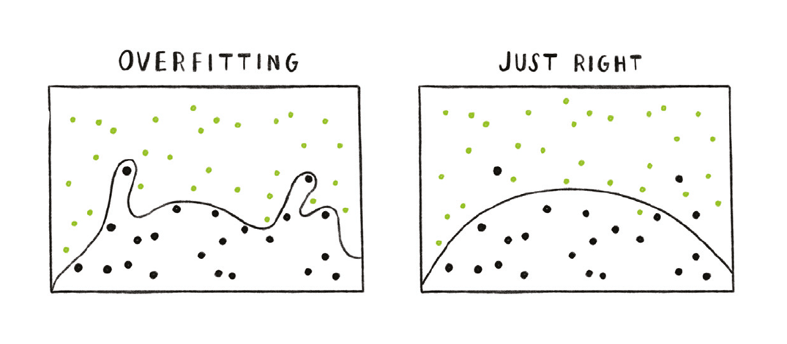

----

## What are Bias and Variance

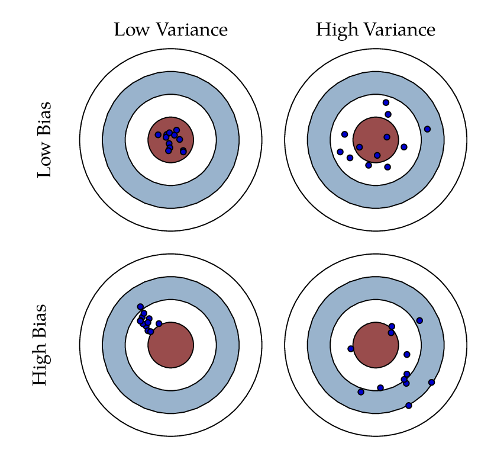

----

## The bias-variance tradeoff (signal vs noise)

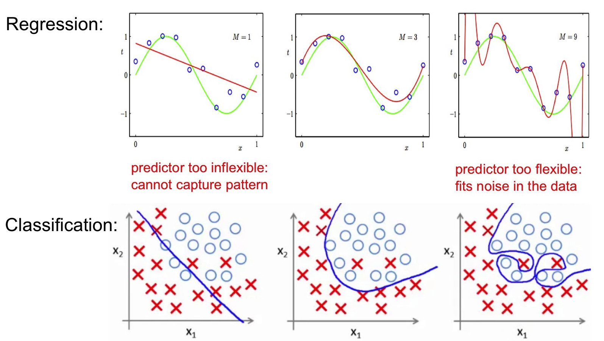

----

## How do we solve this?

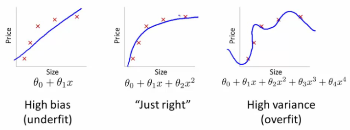

> We need to adjust the complexity of our model

---

## Reducing Overfitting

There are two often used techniques for reducing overfitting:

1. L2 Regularization (Ridge Regression)
2. L1 Regularization (Lasso Regression)

They both **add bias to the model to reduce variance**

----

## Regularizaton

Originally we were minimizing the error:

$$ \sum\_{i=1}^n L(\beta, x\_i) = \sum\_{i=1}^n y\_i\log (\hat{y}_\beta(x)) + (1 - y\_i)\log (1 - \hat{y}_\beta(x_i))$$

If we add a constant term *(bias)* to the error, we get:

$$ \min\_{\beta}\sum\_{i=1}^n L(\beta, x\_i) + \lambda \Vert\beta\Vert$$

where $\Vert\beta\Vert$ is the "size" of $\beta$

----

## L2 Regularization (aka Ridge)

In the case of L2 regularization, we have $\Vert\beta\Vert_2 = \sum_i\beta_i^2$, or

$$ \min\_{\beta}\sum\_{i=1}^n L(\beta, x\_i) + \lambda \sum_{j=1}^M\beta_j^2$$

this is the same as

$$ \min\_{\beta}\sum\_{i=1}^n L(\beta, x\_i)$$

with the constraint that $\sum_{j=1}^M\beta_j^2 < \lambda$

----

## L2 Visual Aid

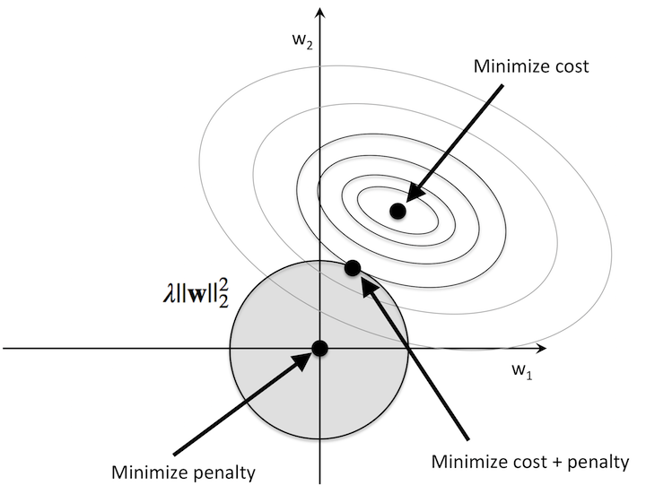

----

## Controlling Regularization with $\lambda$

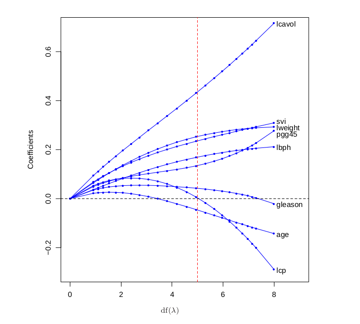

----

## L1 Regularization (aka Lasso)

With lasso we use the L1 norm $\Vert \beta \Vert\_1 = \sum_{j}\|\beta_j\|$, which gives:

$$ \min\_{\beta}\sum\_{i=1}^n L(\beta, x\_i)$$

with the constraint that $\sum_{j=1}^M\|\beta_j\| < \lambda$

> What area of the parameter space is allowed?

----

# L1 Visual Aid

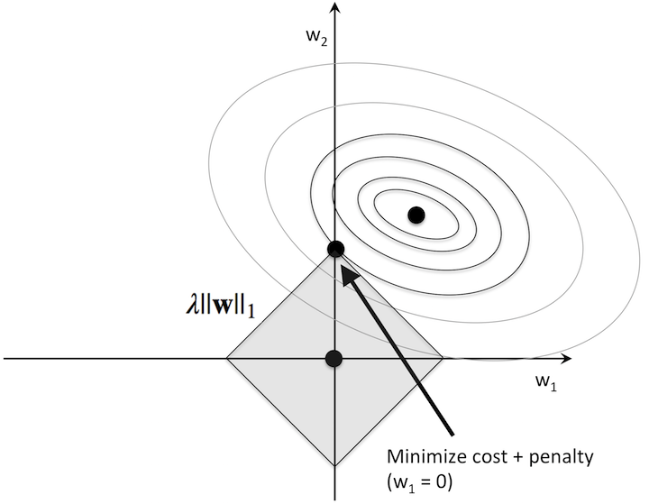

----

## Controlling Regularization with $\lambda$

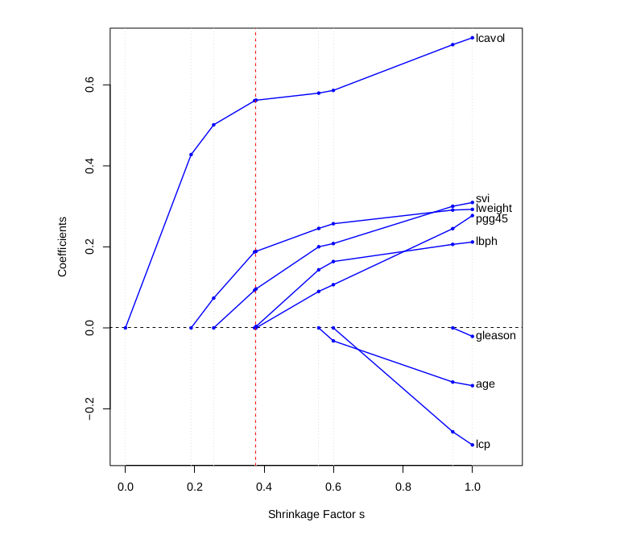

---

# Building our own Logistic Regression

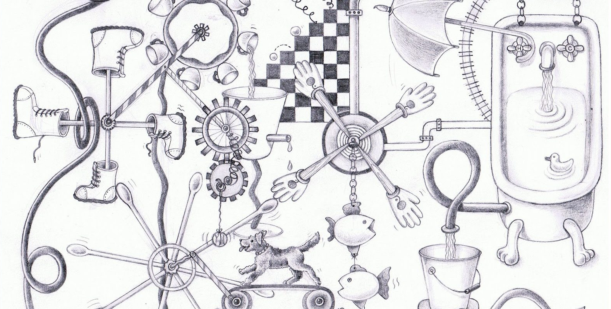
