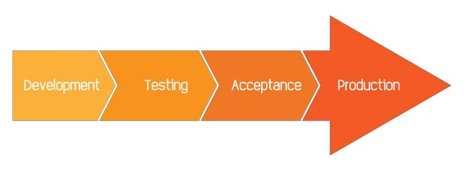
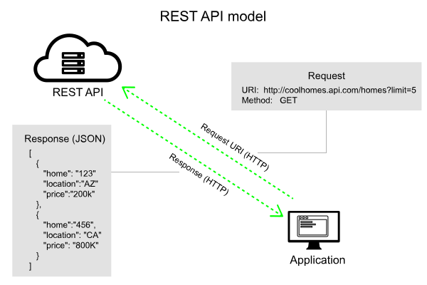
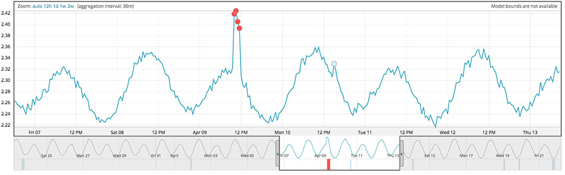
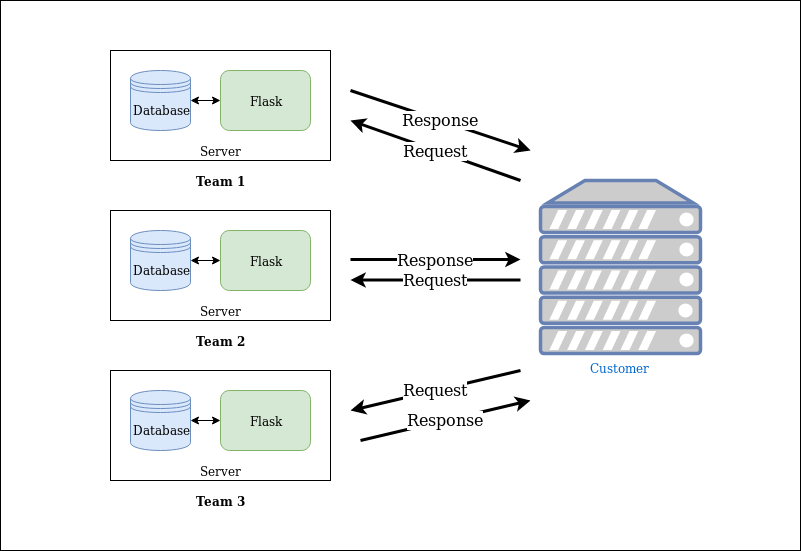

# Getting Your Model in Production

Making your code useful, and common pitfalls to avoid

---

## What is "Production"

> **Production** is an environment which users (internal or external) will interact with

We want this software to be *stable* and *bug-free*

----

## DTAP: Keeping Production Bug-Free



- Development: Where code is developed (eg. laptop, cluster, etc)<!-- .element: class="fragment" -->
- Testing: Where code is tested against a set of tests, including test data<!-- .element: class="fragment" -->
- Acceptance: Shadow-copy of production. Test integration with other acceptance environments<!-- .element: class="fragment" -->
- Production: Where the code is actually used<!-- .element: class="fragment" -->

> TLDR: Moving D -> P means more data, and more security.<!-- .element: class="fragment" -->

----

## Normal IT vs Data Science

DTAP was created for *traditional* software development, Data-Science is a little different.

- We need real data to develop models <!-- .element: class="fragment" -->
- Writing unit-tests for a model isn't trivial <!-- .element: class="fragment" -->

----

## Not All P is the Same

At ING we categorize **Production** according to 3 things:

* Confidentiality: How bad is it if this data leaks out?<!-- .element: class="fragment" -->
- Integrity: How bad is it if the data is incorrect?<!-- .element: class="fragment" -->
- Availability: How bad is it if this service can't be reached?<!-- .element: class="fragment" -->

Together these are called the CIA rating<!-- .element: class="fragment" -->

The higher the CIA rating is, the stricter the requirements are<!-- .element: class="fragment" -->

---

## Putting DS Models into Production

After we develop our fancy statistical models, we want them to be used. 

<span style="font-size:48px;">How?</span><!-- .element: class="fragment" -->

- Scheduled batch processing<!-- .element: class="fragment" -->
- On-demand API<!-- .element: class="fragment" -->

----

## Serving Models as a (REST) API



1. An application sends an `HTTP` request (**model features**)
2. The server returns a response (**the prediction**)

----

## Flask (easy API's in python)

Flask is a **web-framework** in python

Hello world:
```python
from flask import Flask
app = Flask(__name__)

@app.route('/')
def hello_world():
    return 'Hello, World!'

if __name__ == '__main__':
    app.run()
```

1. Easy to setup an API with a few lines of code<!-- .element: class="fragment" -->
2. Integrates nicely with existing DS tools, since Flask is python<!-- .element: class="fragment" -->

----

## Example of Model API

```python
# Here we specify the endpoint ('http://mywebsite.com/api') and specify GET requests
@app.route('/api', methods=['GET'])
def make_prediction():
    
    # Here we retrieve the features from the API request
    features = request.args.get('features')
    
    # If we already loaded our trained classifier, we do our prediction
    pred = clf.predict(features)

    # We return our prediction in JSON
    return jsonify({"pred": pred})
```

---

## Python's pickle


Standard to save/load python objects as files

```python
# Here we write our object to a file
with open('my_pickle.pkl', 'wb') as file:
    pickle.dump(my_object, file)

# In some other script or environment we load the same object
with open('my_pickle.pkl', 'rb') as file:
    same_object = pickle.load(file)
```

Can be loaded with `import pickle`, and is included with python

<span style="font-size:36px;">Great for saving a trained scikit-learn pipeline!</span><!-- .element: class="fragment" -->

---

## Production Code

**Informative**
- Logging what it does
- Easy to debug after its run (we can trace each step)

**Robust**
- Expect the unexpected (weird input values, restarts)
- Fail graciously, restart

**Bug-free**
- Simple code is easier to keep bug-free, and to test

----

## Logging

Most software uses logfiles, which are central files which contain **one-liners** with useful information

```bash
Jul  4 09:09:38 XPS13 kernel: [34472.952336] IPv6: ADDRCONF(NETDEV_UP): wlp58s0: link is not ready
Jul  4 09:09:38 XPS13 kernel: [34473.032310] IPv6: ADDRCONF(NETDEV_UP): wlp58s0: link is not ready
Jul  4 09:09:43 XPS13 kernel: [34477.930333] wlp58s0: authenticate with c4:0a:cb:89:fa:ed
Jul  4 09:09:43 XPS13 kernel: [34477.980418] wlp58s0: send auth to c4:0a:cb:89:fa:ed (try 1/3)
Jul  4 09:09:43 XPS13 kernel: [34477.981070] wlp58s0: authenticated
Jul  4 09:09:43 XPS13 kernel: [34477.983282] wlp58s0: associate with c4:0a:cb:89:fa:ed (try 1/3)
Jul  4 09:09:43 XPS13 kernel: [34477.988447] wlp58s0: RX AssocResp from c4:0a:cb:89:fa:ed (capab=0x101 status=0 aid=10)
Jul  4 09:09:43 XPS13 kernel: [34477.991089] wlp58s0: associated
Jul  4 09:09:43 XPS13 kernel: [34477.991342] ath: EEPROM regdomain: 0x8210
Jul  4 09:09:43 XPS13 kernel: [34477.991344] ath: EEPROM indicates we should expect a country code
Jul  4 09:09:43 XPS13 kernel: [34477.991346] ath: doing EEPROM country->regdmn map search
Jul  4 09:09:43 XPS13 kernel: [34477.991349] ath: country maps to regdmn code: 0x37
Jul  4 09:09:43 XPS13 kernel: [34477.991351] ath: Country alpha2 being used: NL
Jul  4 09:09:43 XPS13 kernel: [34477.991352] ath: Regpair used: 0x37
Jul  4 09:09:43 XPS13 kernel: [34477.991355] ath: regdomain 0x8210 dynamically updated by country IE
Jul  4 09:09:43 XPS13 kernel: [34477.991991] IPv6: ADDRCONF(NETDEV_CHANGE): wlp58s0: link becomes ready
```
----

## Logging in Python

Python has a built-in module for logging, `import logging`.

```python
import logging

logger = logging.getLogger()
handler = logging.StreamHandler()
formatter = logging.Formatter('%(asctime)s %(name)-12s %(levelname)-8s %(message)s')
handler.setFormatter(formatter)
logger.addHandler(handler)
logger.setLevel(logging.DEBUG)

logger.debug('Something just happened, I'd better send it to the debugger!')
```

----

## What to Log

The rule of thumb with logging, log anything which can help you debug in the future:
1. Loading of objects
2. Preprocessing of data (which can fail)
3. When a request happens
4. Who made the request
5. Writing of information to databases

Ask your friendly DevOps for advice, they're much better at this stuff

----

## Model Monitoring



We look at this dashboard or report when we have problems like:
- What is the current accuracy of my model?
- Why is the accuracy going down?
- Has the distribution of my population changed?

So is my model working as expected, and if not, why?

----

## What Causes Model Degradation?


Lots of possible causes:
1. Data is gathered in a different way
2. The population you are scoring on has a different distribution than in training
3. The nature of the problem has changed

----

## What to Look At

In general you should monitor:
- DS metrics like AUC/precision/recall, but also business relevant metrics
- Follow your feature distributions over time, to understand why your performance is changing
  - Compare them with the training distributions
- Anything else that might be useful

----

## Robust Code

Use `try/catch` when you think code might fail:

```python
try:
    # This code might fail
    output = func(input)

# This block is executed when it does with a SpecificError
except SpecificError as e:
    # We log this error, to help us in the future
    logger.log("[ERROR] {error}".format(error = e))
    # We might need to clean up if the error happens
    on_fail_do()
    clean_up()
```

----

## Bug-free Code

Unit-tests can help prevent bugs

```
import unittest

def fun(x):
    return x + 1

class MyTest(unittest.TestCase):
    def test(self):
        self.assertEqual(fun(3), 4)
```

For more information on unittesting and python testing frameworks, look at [pytest](https://docs.pytest.org/en/latest/)

---

## Other Issues to Keep in Mind

- Oops, I used information in Dev that wasn't available in Prod
- My score influences the outcome (example collections, fraud)
- Can take a while before you get feedback on the true label/score

---

## Mini-Game: Building your own API

1. You're going to train a model and serve it as an API in flask
2. A "customer" will be requesting model predictions from your API
    - If you predict the correct outcome, you get 1 points
    - If you return a prediction successfully, you get 0 points
    - If you fail to return a prediction, you get -1 points

----

## How to Play 

**What you get**
1. Server with a database already setup
2. A training dataset
3. Some starter code

**What you need to do**
1. Train a model
2. Get your API working in flask
3. Save your results to a database to retrain your model in the future
4. Whatever you think will help you get the top score!

----

## Starter Project

```sh
.
├── data                            # Put data here
│   └── train_data.csv              # Initial training data
├── database_docker
├── main.py                         # Flask code
├── models                          # Save your trained models here
├── modules
│   └── database.py                 # Some useful functions for working with the database
├── notebooks
│   └── training_notebook.ipynb     # This can be used to train your model
├── output                          # Save any reports here
└── server
```
---

## Instructions

- Creating users
- How to connect (SSH)
- How to work with database
